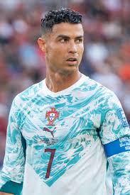
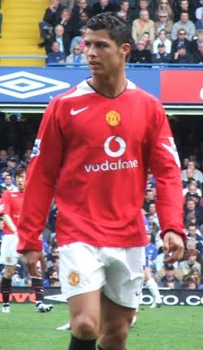

# О Криштиану Роналду

{ width="360" }

## Биография

- **Полное имя:** Cristiano Ronaldo dos Santos Aveiro
- **Дата рождения:** 5 февраля 1985
- **Место рождения:** Фуншал, Мадейра (Португалия)
- **Амплуа:** нападающий
- **Номер:** 7

## Образование и путь в футбол

| Этап | Где |
|------|-----|
| Детство | Мадейра |
| Академия | Sporting CP |
| Большой футбол | Manchester United |

## Сильные стороны

- удар
- скорость
- игра головой
- трудолюбие

## Интересы вне поля

Роналду известен не только футболом. У него есть бренд **CR7**, он занимается бизнесом и благотворительностью.

> «Talent without working hard is nothing.»  
> — Cristiano Ronaldo

{ width="320" }
