University: [ITMO University](https://itmo.ru/ru/)  
Faculty: [FICT](https://fict.itmo.ru)  
Course: [Введение в веб технологии](https://itmo-ict-faculty.github.io/introduction-in-web-tech/)  
Year: 2025/2026  
Group: U4225  
Author: Matsukov Artem Sergeevich  
Lab: Lab1  
Date of create: 08.09.2026  
Date of finished: —

---

# Lab1 — Основы работы с Docker

## Цель работы

Научиться работать с Docker: устанавливать Docker, использовать готовые образы, управлять контейнерами и томами, а также создавать собственный Dockerfile по техническим требованиям и запускать контейнеризированное приложение.

## Окружение

- **ОС:** macOS (MacBook Air)
- **Docker:** Docker Desktop
- **Версия:** Docker 28.3.2

Скриншоты: `[screenshots/](./screenshots/)`  
Исходники Flask-приложения: `[flask-app/](./flask-app/)`

---


## Часть 1. Базовые команды Docker


### 1.1. Проверка установки

```bash
docker --version
```

Результат: `Docker version 28.3.2, build 578ccf6`.

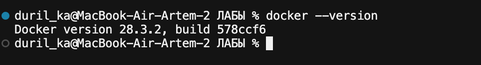

### 1.2. Тестовый контейнер и список образов

```bash
docker run hello-world
docker images
```

Контейнер `hello-world` успешно выполнился. В локальном хранилище появился соответствующий образ.

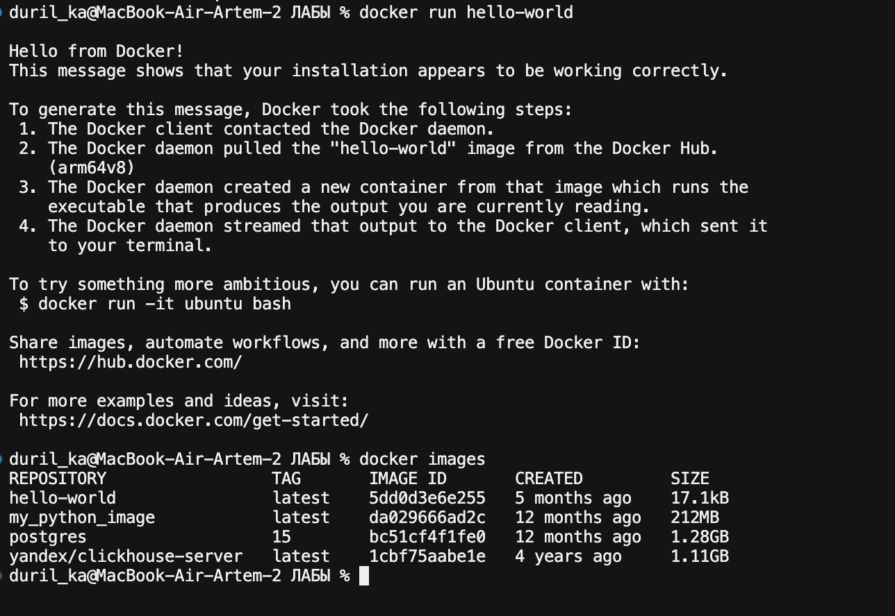

### 1.3. Список контейнеров

```bash
docker ps -a
```

Контейнер `hello-world` имеет статус `Exited (0)` — ожидаемое поведение для одноразового тестового образа.

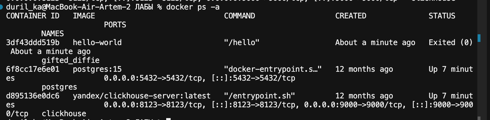

### 1.4. Работа с образом Ubuntu

```bash
docker pull ubuntu:latest
docker run -it ubuntu bash
apt update && apt install -y curl
curl --version
exit
```

Внутри контейнера установлен и проверен `curl` (`curl 8.18.0`, архитектура `aarch64`).

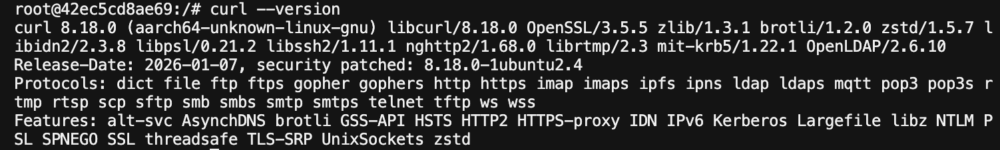

### 1.5. Запуск nginx

```bash
docker run -d -p 8080:80 --name web-server nginx:alpine
```

В браузере открылась страница `Welcome to nginx!`.

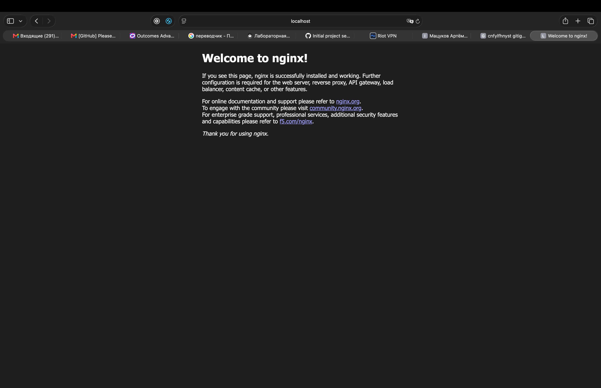

Логи контейнера:

```bash
docker logs web-server
```

В логах видны старт nginx и успешные HTTP-запросы `GET /` со статусом `200`.

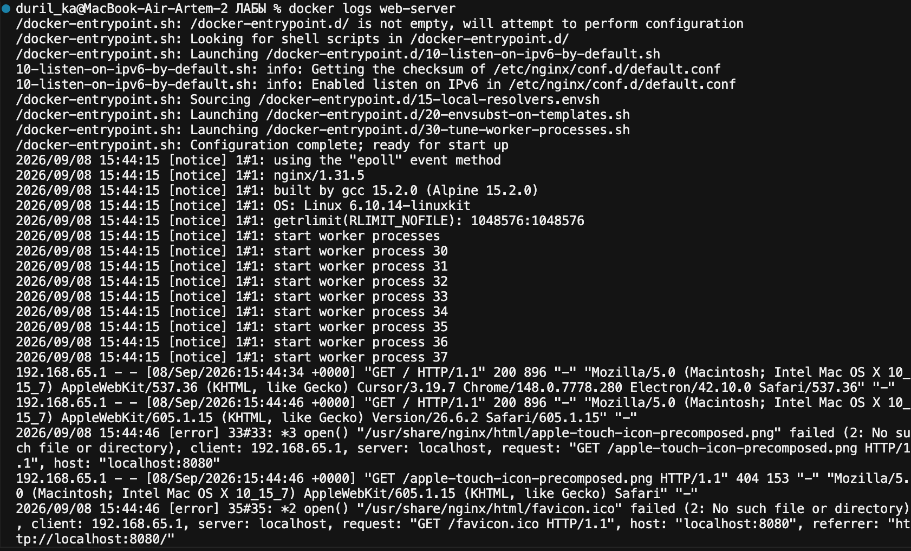

Состояние контейнеров:

```bash
docker ps -a
```

Контейнер `web-server` в статусе `Up`, проброс портов: `0.0.0.0:8080->80/tcp`.

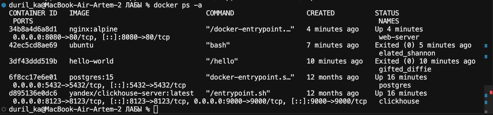

### 1.6. Управление контейнерами

Отработаны команды:

```bash
docker ps
docker ps -a
docker stop web-server
docker start web-server
docker rm web-server
docker rmi nginx:alpine
```


| Команда                 | Назначение                       |
| ----------------------- | -------------------------------- |
| `docker ps` / `ps -a`   | запущенные / все контейнеры      |
| `docker stop` / `start` | остановить / запустить контейнер |
| `docker rm` / `rmi`     | удалить контейнер / образ        |


### 1.7. Работа с томами (volumes)

```bash
docker volume create my-volume
docker run -it --name volume-test -d -v my-volume:/data ubuntu bash
docker exec -it volume-test bash
echo "Hello from volume" > /data/test.txt
cat /data/test.txt
```

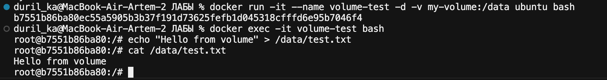

После удаления контейнера и создания нового с тем же томом файл сохранился:

```bash
docker rm -f volume-test
docker run -it --name volume-test-2 -d -v my-volume:/data ubuntu bash
docker exec -it volume-test-2 bash
cat /data/test.txt
```

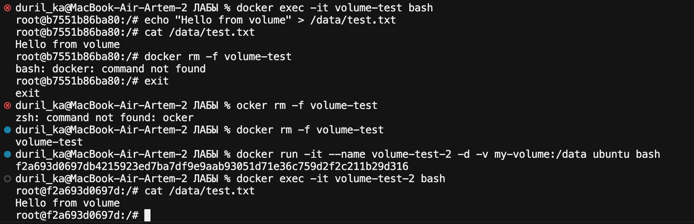

**Вывод части 1:** Docker установлен, базовые команды освоены, показана работа с готовыми образами, портами и volumes.

---


## Часть 2. Создание Dockerfile (Flask-приложение)


### 2.1. Файлы проекта

Создана папка `flask-app/` со следующей структурой:

```text
flask-app/
├── Dockerfile
├── app.py
└── requirements.txt
```


#### `app.py`

Приложение Flask слушает `0.0.0.0:5000` и возвращает строку `Hello from Docker!`.

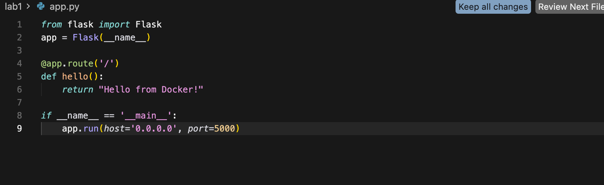

#### `requirements.txt`

```text
Flask==2.0.1
Werkzeug==2.0.3
```

> **Замечание:** по заданию указан только `Flask==2.0.1`. При установке pip подтягивает Werkzeug 3.x, из‑за чего Flask 2.0.1 падает с ошибкой `ImportError: cannot import name 'url_quote'`. Для совместимости зафиксирован `Werkzeug==2.0.3`.


### 2.2. Dockerfile

Dockerfile удовлетворяет всем условиям задания:


| Требование                          | Реализация                        |
| ----------------------------------- | --------------------------------- |
| Базовый образ `python:3.9-slim`     | `FROM python:3.9-slim`            |
| Рабочая директория `/app`           | `WORKDIR /app`                    |
| Системные пакеты `curl`, `vim`      | `apt-get install -y curl vim`     |
| Python-пакеты из `requirements.txt` | `pip install -r requirements.txt` |
| Копирование `app.py`                | `COPY app.py .`                   |
| Пользователь `appuser` с UID 1000   | `useradd -u 1000 appuser`         |
| Переключение на `appuser`           | `USER appuser`                    |
| Порт 5000                           | `EXPOSE 5000`                     |
| `FLASK_ENV=production`              | `ENV FLASK_ENV=production`        |
| Запуск `python app.py`              | `CMD ["python", "app.py"]`        |


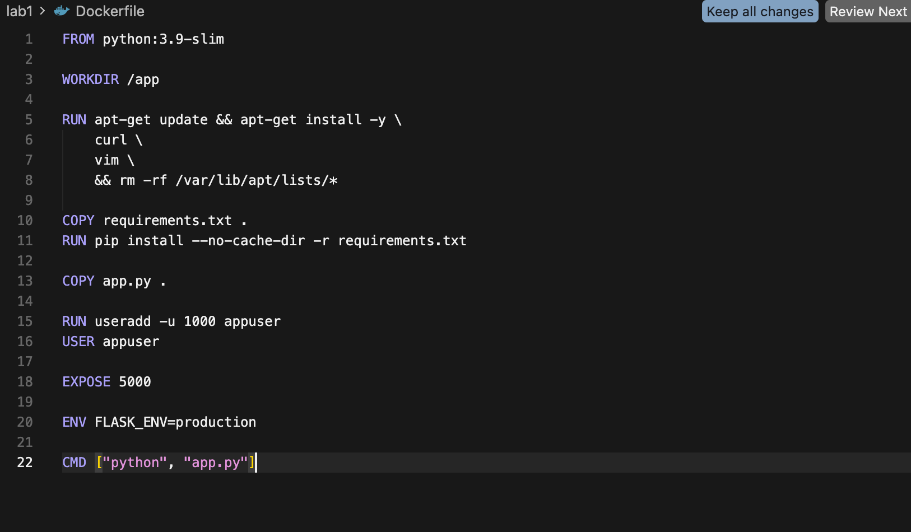

### 2.3. Сборка образа

```bash
docker build -t my-flask-app .
```

Сборка завершилась успешно, образ помечен как `my-flask-app:latest`.

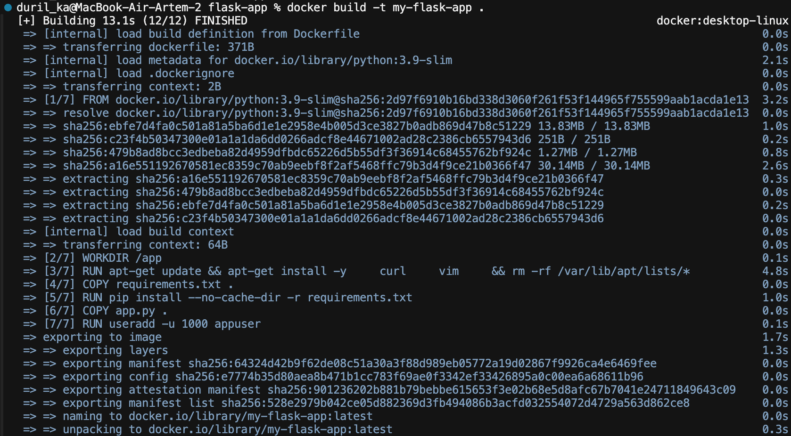

### 2.4. Запуск и проверка

На macOS порт **5000** занят системным процессом AirPlay Receiver (`ControlCenter`). Поэтому контейнер запущен с пробросом **5001→5000**:

```bash
docker run -d -p 5001:5000 --name flask-container my-flask-app
curl http://localhost:5001
```

Результат:

```text
Hello from Docker!
```

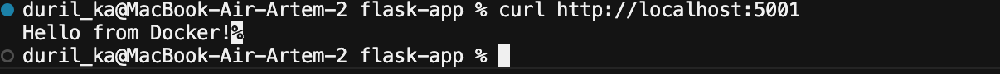

Внутри контейнера приложение по-прежнему слушает порт 5000; с хоста обращение идёт на 5001.

