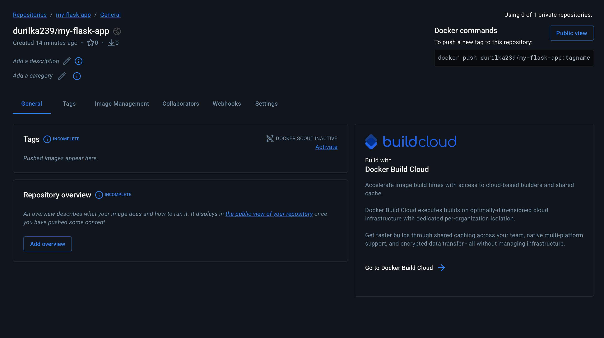
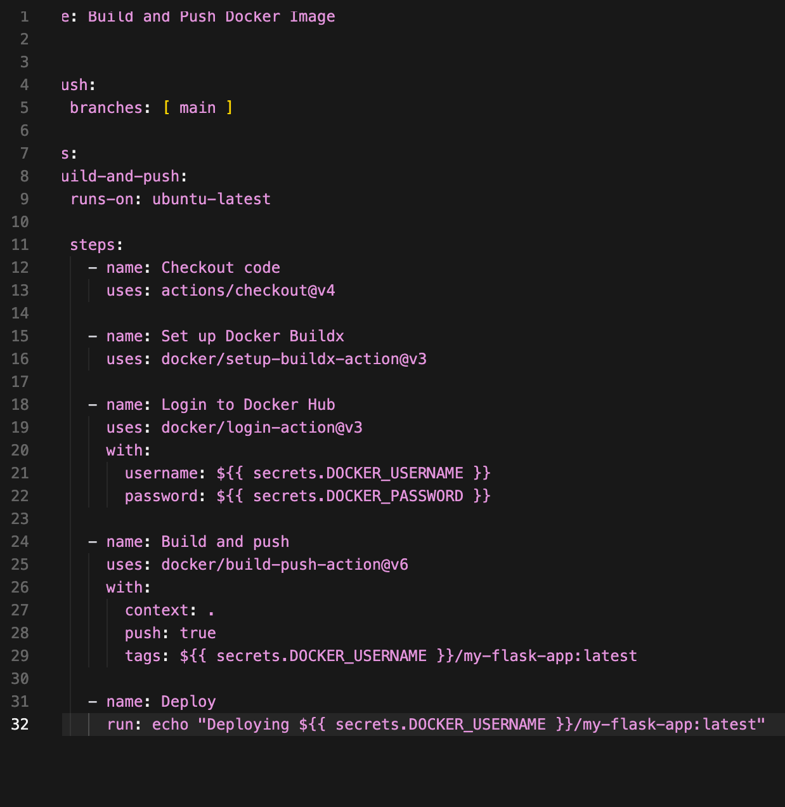
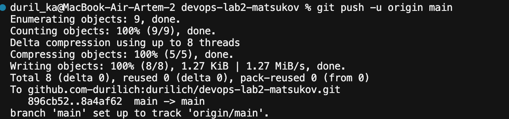
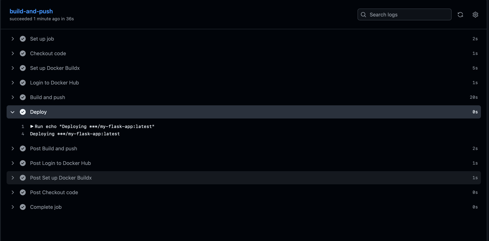
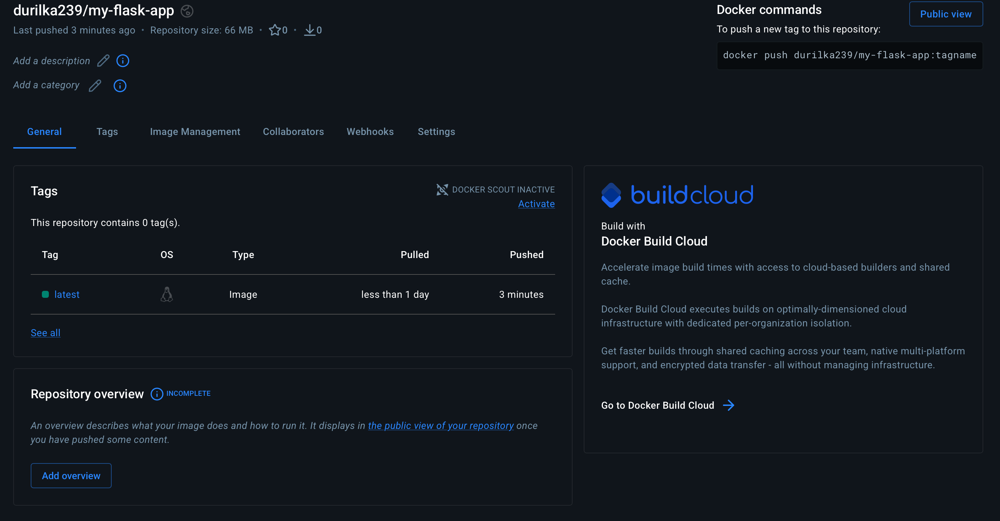

University: [ITMO University](https://itmo.ru/ru/)  
Faculty: [FICT](https://fict.itmo.ru)  
Course: [Введение в веб технологии](https://itmo-ict-faculty.github.io/introduction-in-web-tech/)  
Year: 2025/2026  
Group: U4225  
Author: Matsukov Artem Sergeevich  
Lab: Lab2  
Date of create: 09.09.2026  
Date of finished: —

---

# Lab2 — CI/CD пайплайн с GitHub Actions

## Цель работы

Научиться настраивать автоматизированные пайплайны для сборки Docker-образов, их публикации в registry и автоматического деплоя при изменении кода.

## Практический репозиторий


| Параметр   | Значение                                                                                             |
| ---------- | ---------------------------------------------------------------------------------------------------- |
| GitHub     | [https://github.com/durilich/devops-lab2-matsukov](https://github.com/durilich/devops-lab2-matsukov) |
| Docker Hub | [https://hub.docker.com/r/durilka239/my-flask-app](https://hub.docker.com/r/durilka239/my-flask-app) |
| Образ      | `durilka239/my-flask-app:latest`                                                                     |
| Workflow   | `.github/workflows/docker-build.yml`                                                                 |


Скриншоты: `[screenshots/](./screenshots/)`

---


## 1. Подготовка проекта


### 1.1. Репозиторий GitHub

Создан и склонирован репозиторий `devops-lab2-matsukov`. В корень скопированы файлы из Lab1:

```text
devops-lab2-matsukov/
├── .github/workflows/docker-build.yml
├── app.py
├── requirements.txt
└── Dockerfile
```


### 1.2. Репозиторий на Docker Hub

Создан репозиторий образа `durilka239/my-flask-app` (изначально без тегов — до первого успешного push из Actions).



### 1.3. Секреты GitHub Actions

В настройках репозитория (`Settings → Secrets and variables → Actions`) добавлены секреты:


| Имя               | Назначение                       |
| ----------------- | -------------------------------- |
| `DOCKER_USERNAME` | логин Docker Hub (`durilka239`)  |
| `DOCKER_PASSWORD` | Personal Access Token Docker Hub |


Секреты используются в workflow как `${{ secrets.DOCKER_USERNAME }}` и `${{ secrets.DOCKER_PASSWORD }}`, поэтому учётные данные не хранятся в коде.

---


## 2. Настройка GitHub Actions

Создан файл `.github/workflows/docker-build.yml`.

Пайплайн:

- запускается при **push в** `main`;
- runner: `ubuntu-latest`;
- шаги: checkout → Docker Buildx → login в Docker Hub → build & push → учебный deploy (`echo`).



### Соответствие требованиям задания


| Требование                                   | Реализация                      |
| -------------------------------------------- | ------------------------------- |
| Запуск при пуше в `main`                     | `on.push.branches: [main]`      |
| Ubuntu runner                                | `runs-on: ubuntu-latest`        |
| Checkout кода                                | `actions/checkout@v4`           |
| Docker Buildx                                | `docker/setup-buildx-action@v3` |
| Login через секреты                          | `docker/login-action@v3`        |
| Сборка и push `username/my-flask-app:latest` | `docker/build-push-action@v6`   |
| Шаг деплоя                                   | `echo "Deploying ..."`          |


---


## 3. Тестирование пайплайна


### 3.1. Push в main

После добавления файлов и workflow выполнен push в `main` (через SSH-хост `github.com-durilich` для аккаунта `durilich`):

```bash
git push -u origin main
```



### 3.2. Результат в GitHub Actions

В разделе **Actions** job `build-and-push` завершился успешно (~36 с). Все шаги зелёные:

1. Checkout code
2. Set up Docker Buildx
3. Login to Docker Hub
4. Build and push
5. Deploy — в логе: `Deploying ***/my-flask-app:latest` (username скрыт маскировкой секретов)



### 3.3. Образ на Docker Hub

После успешного пайплайна в репозитории `durilka239/my-flask-app` появился тег `latest` (размер образа ~66 MB, push несколько минут назад).



