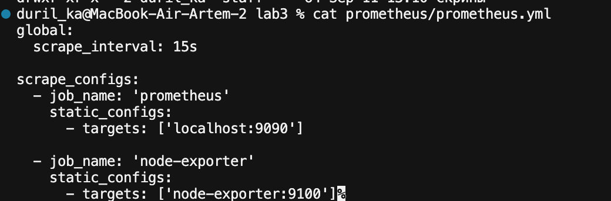
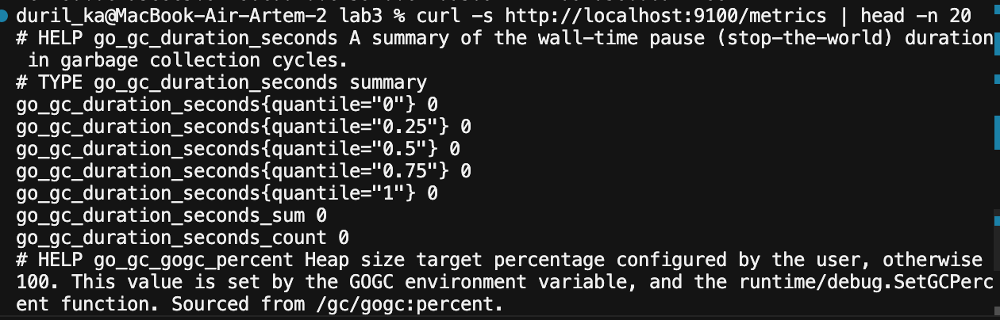
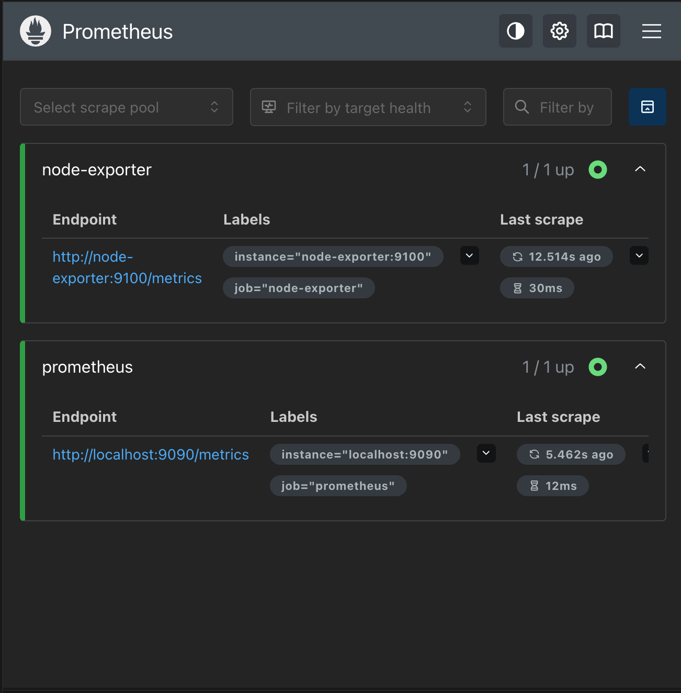
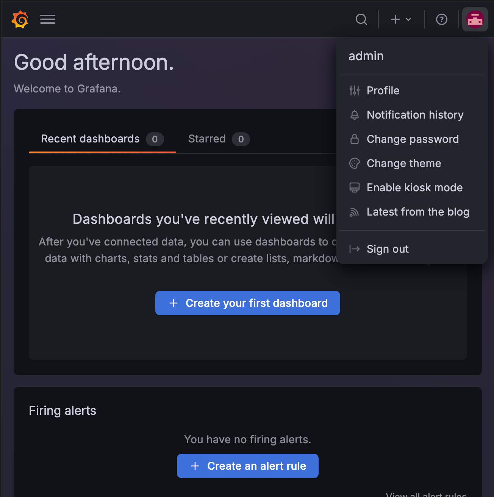
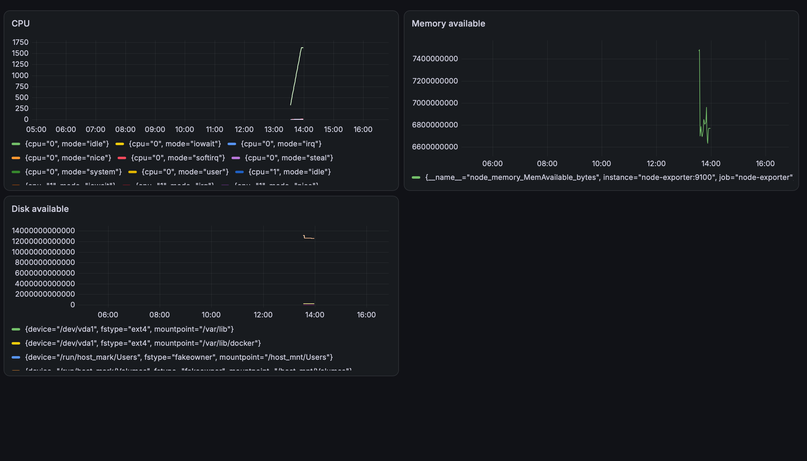
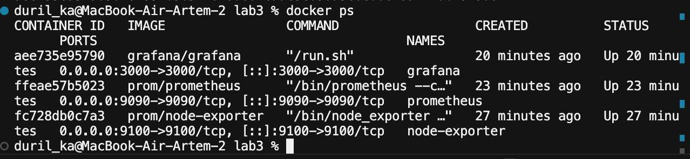

University: [ITMO University](https://itmo.ru/ru/)  
Faculty: [FICT](https://fict.itmo.ru)  
Course: [Введение в веб технологии](https://itmo-ict-faculty.github.io/introduction-in-web-tech/)  
Year: 2025/2026  
Group: U4225  
Author: Matsukov Artem Sergeevich  
Lab: Lab3  
Date of create: 11.09.2026  
Date of finished: —

---

# Lab3 — Мониторинг с Prometheus и Grafana

## Цель работы

Научиться настраивать локальную систему мониторинга: собирать метрики с помощью Prometheus (и Node Exporter) и визуализировать их в Grafana.

## Окружение

- **ОС:** macOS (Docker Desktop)
- **Сеть Docker:** `monitoring`
- **Тома:** `prometheus-data`, `grafana-data`
- **Контейнеры:** `node-exporter`, `prometheus`, `grafana`

Скриншоты: `[screenshots/](./screenshots/)`  
Конфиг: `[prometheus/prometheus.yml](./prometheus/prometheus.yml)`

---


## 1. Конфигурация Prometheus

Создана папка `prometheus/` и файл `prometheus.yml`:

```yaml
global:
  scrape_interval: 15s

scrape_configs:
  - job_name: 'prometheus'
    static_configs:
      - targets: ['localhost:9090']

  - job_name: 'node-exporter'
    static_configs:
      - targets: ['node-exporter:9100']
```

- `scrape_interval: 15s` — опрос целей каждые 15 секунд;
- job `prometheus` — метрики самого Prometheus;
- job `node-exporter` — системные метрики (имя хоста `node-exporter` резолвится в Docker-сети `monitoring`).



---


## 2. Сеть, тома и Node Exporter

Созданы общая сеть и тома:

```bash
docker network create monitoring
docker volume create prometheus-data
docker volume create grafana-data
```

Запущен Node Exporter в сети `monitoring` с пробросом порта `9100` и монтированием `/proc`, `/sys`, `/` для сбора метрик.

Проверка endpoint:

```bash
curl -s http://localhost:9100/metrics | head -n 20
```

Endpoint отвечает метриками в формате Prometheus (`# HELP`, `# TYPE`, ...).



---


## 3. Запуск Prometheus

Контейнер Prometheus запущен из папки `lab3` с монтированием локального конфига:

```bash
-v "$(pwd)/prometheus:/etc/prometheus"
```

UI: [http://localhost:9090](http://localhost:9090)  

**Status → Targets** — оба target в состоянии **UP**:


| Job             | Endpoint                            | Статус |
| --------------- | ----------------------------------- | ------ |
| `node-exporter` | `http://node-exporter:9100/metrics` | UP     |
| `prometheus`    | `http://localhost:9090/metrics`     | UP     |




---


## 4. Запуск Grafana

Контейнер Grafana запущен в сети `monitoring` на порту `3000`, пароль админа задан через `GF_SECURITY_ADMIN_PASSWORD=admin`.

Вход: [http://localhost:3000](http://localhost:3000)  
Логин / пароль: `admin` / `admin`



---


## 5. Data Source Prometheus

В Grafana добавлен источник данных:

- тип: **Prometheus**
- URL: `http://prometheus:9090` (имя сервиса в Docker-сети, не `localhost`)
- **Save & test** — успешно


---


## 6. Дашборд с метриками

Создан дашборд с тремя панелями:


| Панель           | Метрика                          |
| ---------------- | -------------------------------- |
| CPU              | `node_cpu_seconds_total`         |
| Memory available | `node_memory_MemAvailable_bytes` |
| Disk available   | `node_filesystem_avail_bytes`    |


Графики отображают данные, собираемые с `node-exporter:9100`.



---


## 7. Проверка контейнеров

```bash
docker ps
```

Все три сервиса в статусе **Up**:


| Контейнер       | Образ                | Порт        |
| --------------- | -------------------- | ----------- |
| `grafana`       | `grafana/grafana`    | `3000→3000` |
| `prometheus`    | `prom/prometheus`    | `9090→9090` |
| `node-exporter` | `prom/node-exporter` | `9100→9100` |


